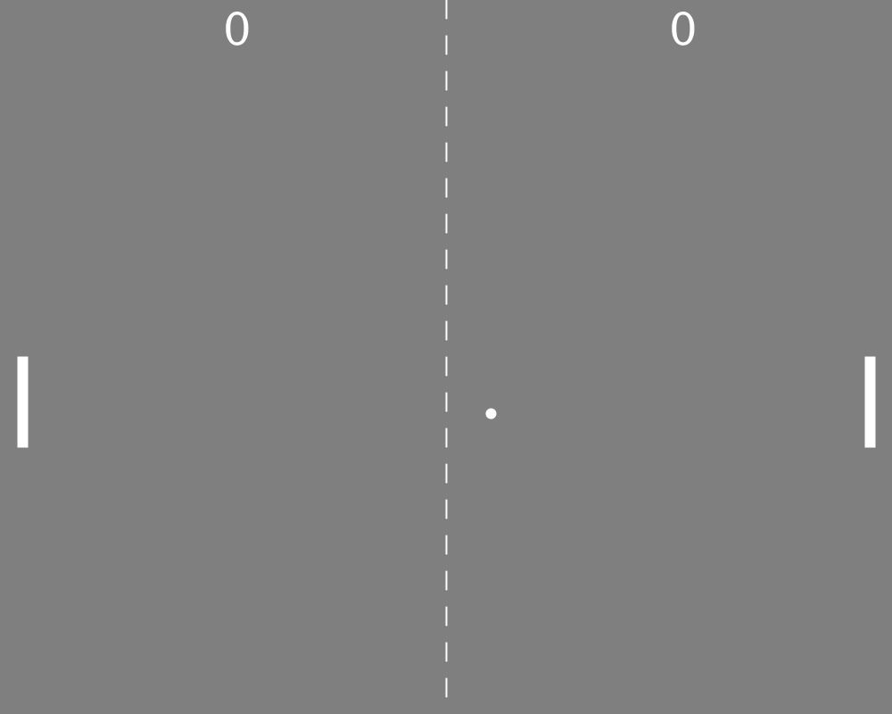

# Pong
El juego de pong hecho en processing.

Autor: Samuel Trujillo Santana

## trabajo realizado
El juego contiene tres ficheros para poder organizarse mejor:

#### Ball
En este fichero creamos la clase Ball que representa la pelota, contiene 5 atributos que indican la posición, la velocidad actural y el tamaño. La clase posee el constructor, un metodo Move y un método ResetBall. El método Move mueve continuamente la pelota, rebotando contra las paredes, activando un sonido al rebotar, y devuelve si ha chocado en alguno de los lados del jugador (devuelve 2 si es punto para el jugador 2,  1 si lo es para el jugador 1, y 0 si no ha chocado). El método ResetBall reinicia la posición de la pelota en el centro de la pantalla a una altura aleatoria e inclinación aleatoria.

#### Player
En este fichero creamos la clase Player que representa las raquetas de los jugadores, contiene 6 atributos que indican su posición, su tamaño, la puntuación actual, y un indicador de si es jugador 1 o 2. La clase posee el constructor, el método Move, el método CheckBall y el método ChangeBallDirection. El método Move mueve la jugador 1 al pulsar 'w' o 's', y al jugador 2, al pulsar las flechas de arriba o abajo. El método CheckBall comprueba si la raqueta del jugador toca la pelota, y en caso de que así sea, altera la dirección de esta y emite un sonido. El método ChangeBallDirection permite añadir dinamismo al juego, provocando que la dirección de la pelota esté mayormente incliana en función de la lejanía al centro de la raqueta
(Cuanto más al centro de la raqueta golpee la pelota, más recta volverá al otro lado del campo).

#### Pong
En este fichero inicializamos la pelota y los dos jugadores, pintamos el entorno de juego y actualizamos los gráficos de la pelota y jugadores. A demás, esta clase llama a los métodos Move de los objetos y controla si se ha anotado para actualizar el marcador, emitir un sonido, y resetear la pelota, apuntando al jugador que haya perdido el punto. Esta clase a su vez está atenta a las pulsaciones de las teclas para controlar a los jugadores.

## Vista del juego

## Referencias
Guión de prácticas de CIU

Referencias Processing https://processing.org/reference/

Librería sound https://processing.org/reference/libraries/sound/

Librería GifAnimation https://github.com/extrapixel/gif-animation
